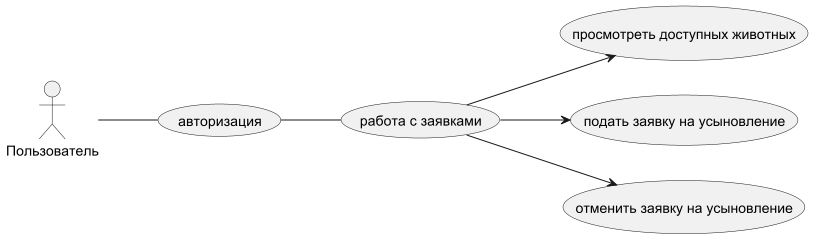
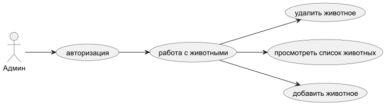

# ОПИСАНИЕ ПРОЕКТА “УЧЕТ ЖИВОТНЫХ В ПРИЮТЕ”

## 1. ПРЕДМЕТНАЯ ОБЛАСТЬ

- Система предназначена для учёта усыновления животных приюта. Она автоматизирует процессы оформления заявок клиентами и управления приютом администратором.
- Работа с системой осуществляется через **консольный интерфейс Python**.

## 2. ЦЕЛИ СИСТЕМЫ

- Автоматизировать процесс усыновления животных.
- Обеспечить администратору удобное управление заявками и приютом.
- Исключить двойные брони и ошибки учёта.
- Упростить взаимодействие клиента и администратора.

## 3. ПОЛЬЗОВАТЕЛИ СИСТЕМЫ

### Клиент — пользователь, который хочет усыновить животное.

Может:
- Посмотреть доступных животных для усыновления
- Подать заявку на усыновление
- Отменить заявку на усыновление

### Администратор — сотрудник приюта.

Может:
- Просмотреть список животных
- Добавить животное в базу
- Убрать животное из базы

## 4. ОСНОВНЫЕ ФУНКЦИИ СИСТЕМЫ

### Функции клиента:

- Подать заявку на усыновление
- Отменить заявку на усыновление
- Просмотр доступных животных для усыновления

### Функции администратора:

- Добавление животного в базу
- Просмотр списка животных
- Удаление животного из базы

## 5. АРХИТЕКТУРА И СПОСОБЫ РЕАЛИЗАЦИИ

Система реализуется по принципу **трёхуровневой архитектуры (Layered Architecture)**:

1. **Presentation Layer (Интерфейс)**  
   Консольное меню Python (выбор действий через текстовый ввод)

2. **Business Logic Layer (Бизнес-логика)**  
   Функции для обработки заявок, проверки доступности усыновления и изменения статусов.

3. **Data Layer (Слой данных)**  
   Хранение информации в базе данных **SQLite** или **PostgreSQL**.